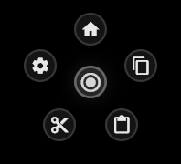

#  Orbit - Floating Keyboard Shortcut Tool

Orbit is a minimal, floating keyboard shortcut tool for Windows designed to streamline your workflow. It provides a quick-access "radial menu" of your most-used keyboard shortcuts, keeping your workspace clean while keeping your tools just one click away.

  

  <video src="assets/demo.mp4" width="600" autoplay loop muted />

## Key Features

- **Floating UI**: A semi-transparent, frameless window that stays on top of your work.
- **JSON Driven**: Fully customize your shortcuts, icons, and labels by simply loading a JSON file.
- **Smart Focus**: Automatically switches focus back to your previous application before triggering the shortcut.
- **Minimalist Design**: Taps into the Windows native API for a lightweight and responsive experience.

## Quick Start

1. **Launch**: Open `orbit.exe`.
2. **Move**: Click and drag the center icon to place it anywhere on your screen.
3. **Trigger**: Click the center to expand the "planets" and click an icon to fire a shortcut.
4. **Customize**: Right-click the center icon to:
   - **Load**: Import a new JSON configuration.
   - **Reload**: Refresh the current configuration after manual edits.
   - **Change Theme**: Toggle between light and dark modes.

## Customization

You can create your own shortcut layouts! Check out the [CONFIG_GUIDE.md](./CONFIG_GUIDE.md) for a full list of supported keys and icons.

## How to Build/Export

To create a standalone version for sharing:

1. Run `flutter build windows --release`.
2. Use **Enigma Virtual Box** to pack the contents of `build/windows/x64/runner/Release/` into a single portable `.exe`.
3. Enjoy your single-file portable tool!
