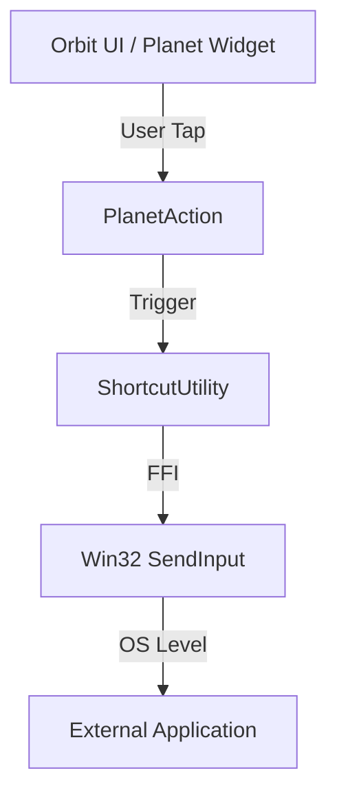

# Orbit Shortcut Simulation Logic

This document explains the architecture and data flow for the shortcut simulation functionality in the Orbit Shortcut Tool.

## 🏗 System Architecture

The tool is built on a layered architecture that transitions from high-level Flutter UI components to low-level Windows API calls.

## 🛠 Functional Components

### 1. Data Model (`PlanetAction`)

Located in `lib/models/planet_action.dart`.

- **Purpose**: Defines what a shortcut _is_.
- **Data**: Stores an icon, a label, and a list of **Virtual Key Codes** (ints).
- **Logic**: Contains the `trigger()` method which acts as the bridge between the UI and the Windows utility.

### 2. Utility Layer (`ShortcutUtility`)

Located in `lib/utils/shortcut_utility.dart`.

- **Purpose**: Handles the "how" of shortcut simulation.
- **Key Methods**:
  - `_prepareFocus()`: Searches the Windows Z-order to find the application that was active _before_ the Orbit tool was clicked. It uses `GetWindow` and `SetForegroundWindow` to pass focus back.
  - `triggerShortcut(List<int> keys)`: The core logic that converts a list of keys into a sequence of "Key Down" and "Key Up" events.

### 3. Simulation Logic (Win32 FFI)

- **SendInput**: We use the Windows `SendInput` API via the `win32` and `ffi` packages.
- **Key Sequence**: To simulate a shortcut like `Ctrl + S`:
  1. Send `LCONTROL` Down
  2. Send `S` Down
  3. Send `S` Up
  4. Send `LCONTROL` Up (LIFO order ensures modifiers wrap the primary key).

---

## 🔄 Data Flow: The Journey of a Click

1.  **UI Event**: User clicks a `Planet` widget in the `Orbit` menu.
2.  **Dispatch**: The `Planet` widget calls `action.trigger()`.
3.  **Telemetry**: `PlanetAction` logs the intent to the debug console.
4.  **Focus Handoff**: `ShortcutUtility` looks for the most recently active visible window (excluding the Orbit tool itself) and forces it to the foreground.
5.  **Small Wait**: A `100ms` delay is introduced to ensure Windows has finished the window transition.
6.  **Memory Allocation**: Using `dart:ffi`, we allocate a block of memory (`calloc<INPUT>`) to hold the keyboard event data structures required by Windows.
7.  **Input Injection**: The `SendInput` system call is executed. Windows injects these keystrokes into the input stream of the newly focused application.
8.  **Cleanup**: The allocated memory is freed using `free()`.

---

## ⌨️ Virtual Key Codes

The tool uses standard Windows Virtual-Key Codes. Common ones used:

- `VK_LCONTROL` (0xA2): Left Control
- `0x53`: 'S' Key
- `0x5A`: 'Z' Key
- `VK_OEM_4` (0xDB): `[` Key
- `VK_OEM_6` (0xDD): `]` Key

## ⚠️ Important Considerations

- **Admin Privileges**: If the target application (e.g., Task Manager) is running as Administrator, the Orbit tool must also run as Administrator to send inputs to it (Windows Security restriction).
- **Transparency**: The tool uses `window_manager` to remain "Always on Top" but intentionally yields focus immediately when a shortcut is triggered.
